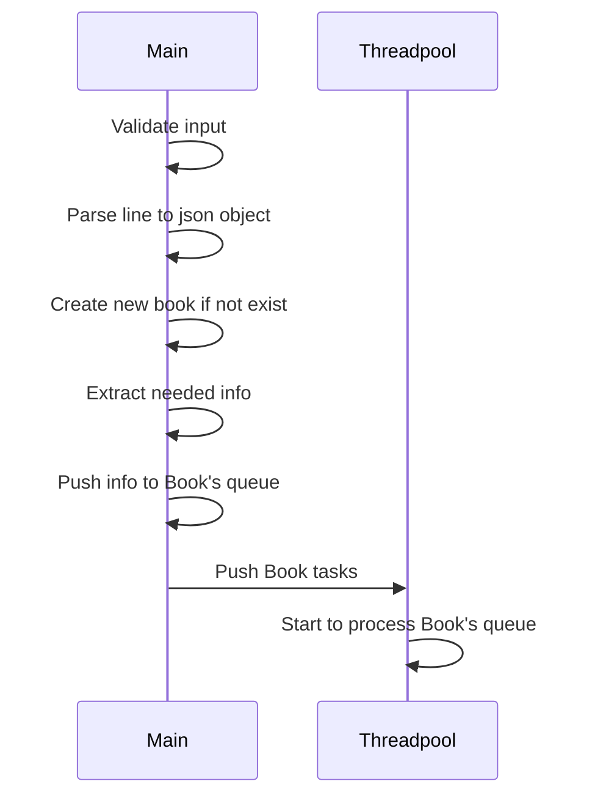
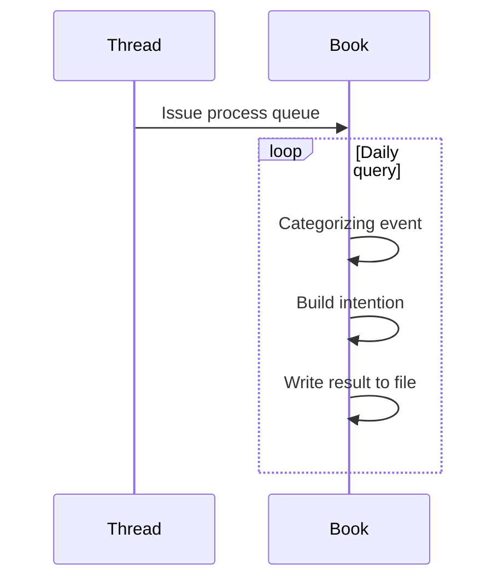

# Marvel homework

## Building system: 
+ wsl2 Fedora
+ gcc (GCC) 12.2.1 20220819 (Red Hat 12.2.1-2)
+ Visual Studio Code

### Build command
clone this repo
```
cd homework
mkdir build && cd build
cmake ..
make
```
Binary files are generated in `/build/bin`

Orderbook is main executable. Usage: `./orderbook [input_file_name]`

Result files are generated in `/build/bin/result`

Test: ./book_test


## Idea overview:



There are two types of info pushed to queue.
+ New book update
+ Trade event

By doing this,  every event can be in time order. There is a case that has many trade events before book update shows up, to resolve this issue, trade queue is created, which is updated whenever trade event happens and cleared after intention building finishes. 




Say that we have current bid{price, quantity}, ask{price, quantity}, new bid{price, quantity}, ask{price, quantity} and trade.


When building intention, logic is as below table:

*More: new/old quantity greater than old/new*\
*Less: new/old quantity less than old/new*\
*Equal: No difference*\
*None: does not have price*\
*Trade yes: price exists in current trade queue*\
*Trade no: price does not exist in current trade queue*

| Trade         | Bid new       | Ask new       | Bid old       | Ask old       | Intention         |
| ------------- | ------------- | ------------- | ------------- | ------------- | -------------     |
| No            | More          | None          | Less          | None          | PASSIVE BUY       |
| No            | More          | None          | None          | None          | PASSIVE BUY       |
| No            | None          | More          | None          | Less          | PASSIVE SELL      |
| No            | None          | More          | None          | None          | PASSIVE SELL      |
| Yes           | None          | Less          | None          | More          | AGGRESSIVE BUY    |
| Yes           | None          | Equal         | None          | Equal         | AGGRESSIVE BUY    |
| Yes           | More          | None          | None          | More          | AGGRESSIVE BUY    |
| Yes           | None          | None          | None          | More          | AGGRESSIVE BUY    |
| Yes           | Less          | None          | More          | None          | AGGRESSIVE SELL   |
| Yes           | Equal         | None          | None          | Equal         | AGGRESSIVE SELL   |
| Yes           | None          | More          | More          | None          | AGGRESSIVE SELL   |
| Yes           | None          | None          | More          | None          | AGGRESSIVE SELL   |
| No            | Less          | None          | More          | None          | CANCELED BUY      |
| No            | None          | None          | More          | None          | CANCELED BUY      |
| No            | None          | Less          | None          | More          | CANCELED SELL     |
| No            | None          | None          | None          | More          | CANCELED SELL     |


## Performance report:
```
Process file time: 2212 milliseconds
Execution time for FORD.BK is: 0 milliseconds
Execution time for VNT is: 0 milliseconds
Execution time for FORD-W3 is: 0 milliseconds
Execution time for VNT.BK is: 0 milliseconds
Execution time for FORD-W3-F is: 0 milliseconds
Execution time for FORD-F.BK is: 1 milliseconds
Execution time for TLMK_RG is: 1 milliseconds
Execution time for AIY is: 0 milliseconds
Execution time for VNT-R.BK is: 0 milliseconds
Execution time for FORD-R.BK is: 1 milliseconds
Execution time for VNT-F is: 1 milliseconds
Execution time for VNT-R is: 0 milliseconds
Execution time for CSGN is: 0 milliseconds
Execution time for SLHN is: 1 milliseconds
Execution time for VNT-F.BK is: 0 milliseconds
Execution time for CLN is: 0 milliseconds
Execution time for UBSG is: 11 milliseconds
Execution time for FORD-W3-R is: 0 milliseconds
Execution time for ABBN is: 11 milliseconds
Execution time for ACES is: 0 milliseconds
Execution time for 005930 is: 0 milliseconds
Execution time for QUEEN is: 11 milliseconds
Execution time for SMGR is: 10 milliseconds
Execution time for 20 is: 11 milliseconds
Execution time for ZURN is: 12 milliseconds
Execution time for CIMB is: 12 milliseconds
Execution time for TAK is: 12 milliseconds
Execution time for NESN is: 13 milliseconds
Execution time for KING is: 12 milliseconds
Execution time for ADEN is: 12 milliseconds
Execution time for UHR is: 13 milliseconds
Execution time for SONG is: 12 milliseconds
Execution time for GLO is: 13 milliseconds
Execution time for EPMB is: 12 milliseconds
Execution time for REX is: 9 milliseconds
Execution time for CFR is: 9 milliseconds
Total time: 2234 milliseconds
```
### Note:
I did test with input file. There is no invalid json string, so I skip json validation.
